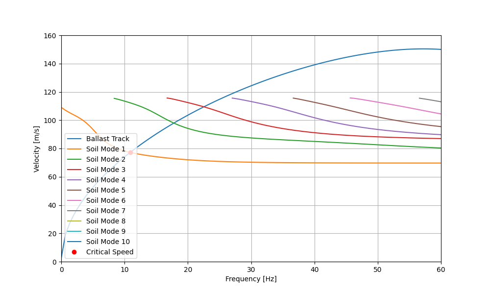
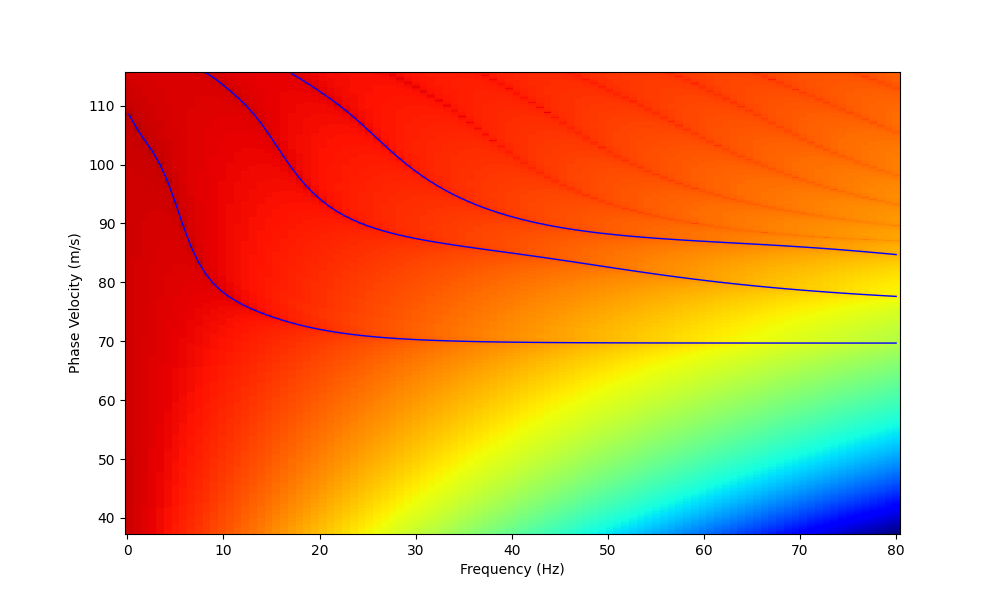
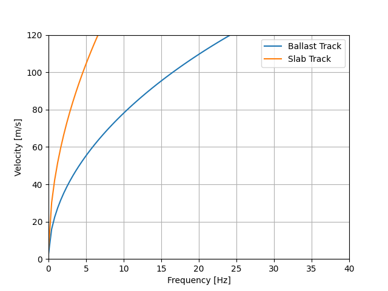
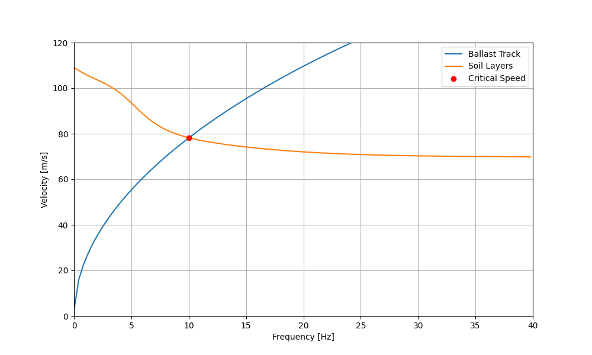

# TrainCritSpeed

A Python package for analyzing critical speeds in railway systems, focusing on soil and track dispersion analysis.

The methodology for the computation of the critical train speed is based on the work of
[Mezher et al. (2016)](https://www.sciencedirect.com/science/article/abs/pii/S2214391215000239).
The dispersion curve for the layered soil is based on the Fast Delta Matrix method proposed by
[Buchen and Ben-Hador (1996)](https://academic.oup.com/gji/article-lookup/doi/10.1111/j.1365-246X.1996.tb05642.x).

## Installation

To install the TrainCritSpeed you can use pip:

```bash
pip install git+https://github.com/PlatypusBytes/TrainCritSpeed
```

## Usage Examples

### Soil Dispersion Analysis

Analyze the dispersion characteristics of a multi-layered soil (soil profile 3 in
[Mezher et al. (2016)](https://www.sciencedirect.com/science/article/abs/pii/S2214391215000239)):

```python
import numpy as np
import matplotlib.pyplot as plt
from TrainCritSpeed.soil_dispersion import Layer, SoilDispersion

# Define soil layers with properties
soil_layers = [
    Layer(density=2000, young_modulus=30e6, poisson_ratio=0.35, thickness=2),
    Layer(density=2000, young_modulus=40e6, poisson_ratio=0.35, thickness=4),
    Layer(density=2000, young_modulus=75e6, poisson_ratio=0.40, thickness=np.inf),
]

number_modes = 10

# Calculate dispersion across frequency range
omegas = np.linspace(1, 80 * 2 * np.pi, 100)
dispersion = SoilDispersion(soil_layers, omegas, number_modes)
dispersion.soil_dispersion()

# Plot results
for mode in range(number_modes):
    plt.plot(omegas / 2 / np.pi, dispersion.phase_velocity[:, mode], label=f"Mode {mode+1}")
plt.xlabel('Frequency [Hz]')
plt.ylabel('Velocity [m/s]')
plt.grid()
plt.xlim(0, 80)
plt.ylim(0, 160)
plt.legend()
plt.show()
```
The result is a plot similar to the following:


If you want to plot the 2D dispersion image (to reproduce Figure 6a in [Mezher et al. (2016)](https://www.sciencedirect.com/science/article/abs/pii/S2214391215000239)) you can use the following code:

```python
from pathlib import Path

dispersion.soil_dispersion_image(file_name=Path("soil_dispersion_contour.png"))
```
The result is a figure saved in the file_name location, similar to the following:


### Track Dispersion Analysis

TrainCritSpeed allows the computation of track dispersion curve for ballasted and slab tracks:

```python
from TrainCritSpeed.track_dispersion import BallastedTrack, BallastTrackParameters
from TrainCritSpeed.track_dispersion import SlabTrack, SlabTrackParameters

# Define frequency range
omega = np.linspace(0.1, 250, 100)

# Configure and analyze ballasted track
ballast_parameters = BallastTrackParameters(
    EI_rail=1.29e7,
    m_rail=120,
    k_rail_pad=5e8,
    c_rail_pad=2.5e5,
    m_sleeper=490,
    E_ballast=130e6,
    h_ballast=0.35,
    width_sleeper=1.25,
    soil_stiffness=0.0,
    rho_ballast=1700
)
ballast = BallastedTrack(ballast_parameters, omega)
ballast.track_dispersion()

# Configure and analyze slab track
slab_parameters = SlabTrackParameters(
    EI_rail=1.29e7,
    m_rail=120,
    k_rail_pad=5e8,
    c_rail_pad=2.5e5,
    EI_slab=30e9 * (1.25 * 0.35**3 / 12),
    m_slab=2500 * 1.25 * 0.35,
    soil_stiffness=0.0,
)
slab = SlabTrack(slab_parameters, omega)
slab.track_dispersion()

# Compare results
plt.plot(omega / 2 / np.pi, ballast.phase_velocity, label="Ballast Track")
plt.plot(omega / 2 / np.pi, slab.phase_velocity, label="Slab Track")
plt.xlabel("Frequency [Hz]")
plt.ylabel("Phase speed [m/s]")
plt.legend()
plt.show()
```

The result is a plot similar to Figure 15a in [Mezher et al. (2016)](https://www.sciencedirect.com/science/article/abs/pii/S2214391215000239):



### Critical Speed Calculation

Calculate the critical speed on a ballasted track (same methodology applies for slab tracks):

```python
import numpy as np
import matplotlib.pyplot as plt

from TrainCritSpeed.track_dispersion import BallastedTrack, BallastTrackParameters
from TrainCritSpeed.soil_dispersion import Layer, SoilDispersion
from TrainCritSpeed.critical_speed import CriticalSpeed

# Define frequency range
omega = np.linspace(0.1, 250, 100)

# Configure ballasted track parameters
ballast_parameters = BallastTrackParameters(
    EI_rail=1.29e7,
    m_rail=120,
    k_rail_pad=5e8,
    c_rail_pad=2.5e5,
    m_sleeper=490,
    E_ballast=130e6,
    h_ballast=0.35,
    width_sleeper=1.25,
    soil_stiffness=0.0,
    rho_ballast=1700
)

# Define soil layers with properties
soil_layers = [
    Layer(density=2000, young_modulus=30e6, poisson_ratio=0.35, thickness=2),
    Layer(density=2000, young_modulus=40e6, poisson_ratio=0.35, thickness=4),
    Layer(density=2000, young_modulus=75e6, poisson_ratio=0.40, thickness=np.inf),
]

# Calculate dispersion for track and soil
ballast = BallastedTrack(ballast_parameters, omega)
dispersion = SoilDispersion(soil_layers, omega)

# Compute critical speed
cs = CriticalSpeed(omega, ballast, dispersion)
cs.compute()
print(f"Critical speed: {cs.critical_speed} m/s")

# Visualize results
plt.figure(figsize=(10, 6))
plt.plot(omega / 2 / np.pi, ballast.phase_velocity, label="Ballast Track")
plt.plot(omega / 2 / np.pi, dispersion.phase_velocity, label="Soil Layers")
plt.plot(cs.frequency / 2 / np.pi, cs.critical_speed, "ro", label="Critical Speed")
plt.xlabel("Frequency [Hz]")
plt.ylabel("Velocity [m/s]")
plt.xlim(0, 40)
plt.ylim(0, 120)
plt.grid()
plt.legend()
plt.show()
```

In this case the critical speed is 78.2 m/s and the plot is similar to Figure 15a in
[Mezher et al. (2016)](https://www.sciencedirect.com/science/article/abs/pii/S2214391215000239).

[](static/critical_speed.png)